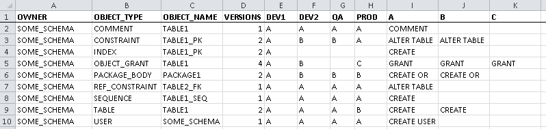
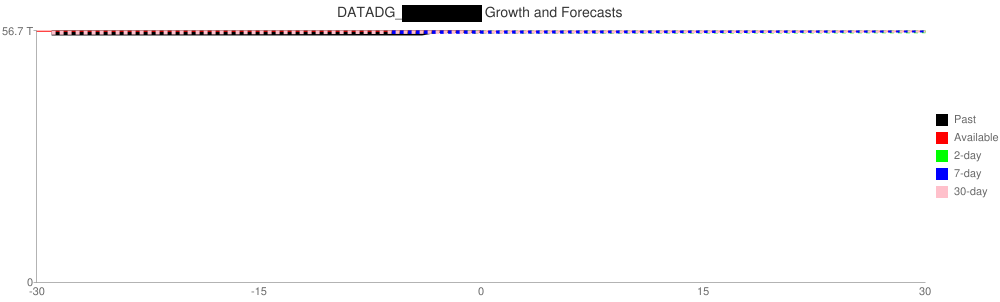
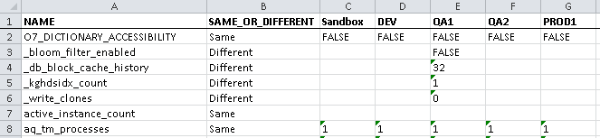
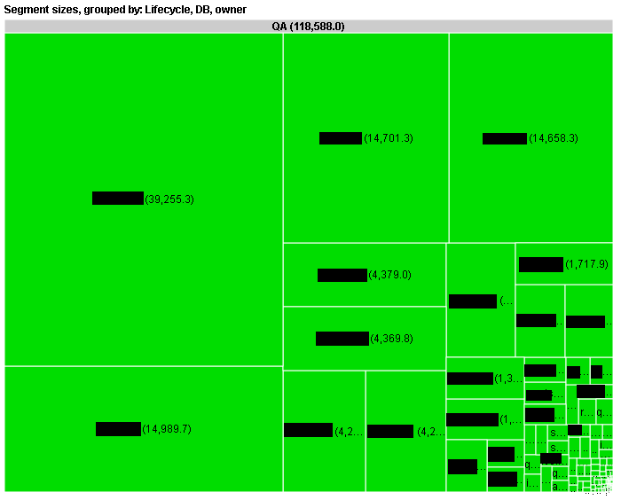

Method5 Scripts
===============

Unlike other automation programs, you generally don't need pre-built "recipes" or "playbooks" to use Method5.  Good DBAs already have loads of useful SQL and PL/SQL statements, it's usually trivial to use them in Method5.

But it can still be useful to see some simple examples of common tasks.

And the advanced examples show the full power of Method5.  When the data gathering becomes trivial then advanced analytics become much easier.

**Advanced Examples**

1. [Compare Everything Everywhere.sql](#compare_everything_everywhere)
2. [ASM Forecast.sql](#asm_forecast)
3. [Active Sessions.sql](#active_sessions)
4. [Compare Parameters.sql](#compare_parameters)
5. [Space Treemap.sql](#space_treemap)
6. [Synchronize DBA Users Job.sql](#synchronize_dba_users_job)

**Simple Examples**

1. [Account Maintenance.sql](#account_maintenance)
2. [Email Active DBA Users Job.sql](#email_active_dba_users_job)
3. [Global Database Statistics.sql](#global_database_statistics)

---

<a name="compare_everything_everywhere"/>

## Compare Everything Everywhere

With a few clicks you can compare schemas between an *unlimited* number of databases, and see all the results in a single view.  This is an easy way to check if a large number of environments are synchronized.

The screenshot shows the output exported to a spreadsheet.  The dense output may look cryptic at first but eventually it will allow you to rapidly identify schema differences.  The letters refer to different versions of the same object.  The columns on the right-hand side contain the entire DDL if you click on the cell.

<a name="asm_forecast"/>

## ASM Forecast

Storage alerts should be based on forecasts, not simple thresholds.  Some databases are designed to be at 99.9% capacity.  Others are in trouble if the capacity quickly reaches 50%.

Now that collecting all the V$ASM_DISKGROUP data is trivial you can focus on more intelligent forecasts.  This script uses ordinary-least-squares regression to predict the capacity in 30 days based on three different forecasts, using data from 2, 7, and 30 days in the past.

This first chart shows a clear problem.  The diskgroup is only 50% full but it only took 15 days for all that growth.

This second chart shows a database at 99.9% capacity.  But don't freak out - it hasn't grown at all in the past 30 days so you probably don't need to add space.

<a name="active_session_counts"/>

## Active Sessions

Why tune one database when you can tune them all at the same time?  If you've built a query against a view like GV$ACTIVE_SESSION_HISTORY you can easily run it against hundreds of databases.

This chart was created to solve the most painful performance problem - when connections "randomly" fail.  Is there a pattern?

When I aggregated session counts for 400 databases, for 60 hosts, it became obvious that activity spiked at the hour mark.  Drilling down it was clear the spikes were caused by AWR starting at the same time, and needed to be staggered.

<a name="compare_parameters"/>

## Compare Parameters

This report makes it trivial to compare all database parameters, for any set of databases, at one time.

<a name="space_treemap"/>

## Space Treemap

These treemap visualizations help you discover exactly where your space is being used.

<a name="synchronize_dba_users_job"/>

## Synchronize DBA Users Job

Automatically synchronize DBA accounts, privileges, profiles, status, and profiles across all databases.

<a name="account_maintenance"/>

## Account Maintenance

Activities like creating accounts, locking accounts, and synchronizing passwords across all databases can be done in one line of code.

<a name="email_active_dba_users_job"/>

## Email Active DBA Users Job

Once it's trivial to gather data you can spend more time looking at potential access issues, such as a list of users with the DBA role.  No need to manage hundreds of crontabs or scheduler jobs.

<a name="global_database_statistics"/>

## Global Database Statistics

Convey the complexity of your environment through a few simple statistics, such as database count, schema count, object count, physical I/O per day, connections per day, queries per day, and segment size.
